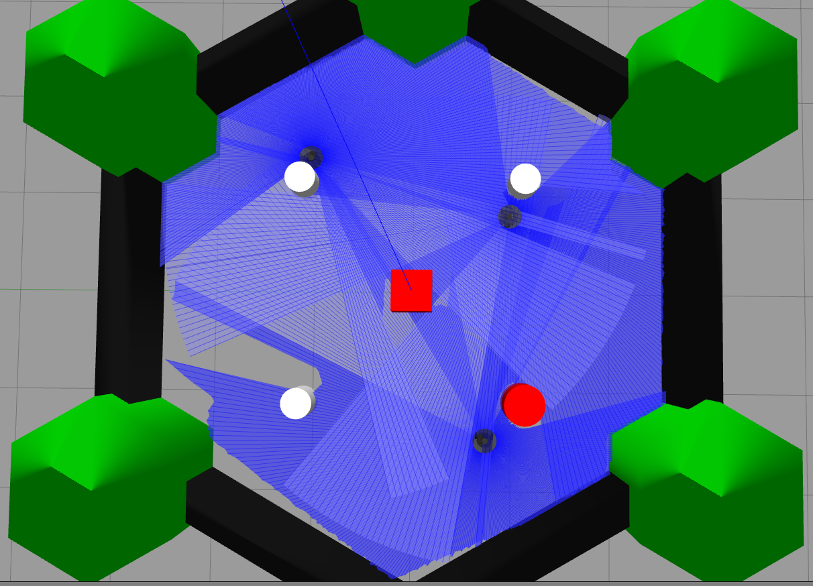
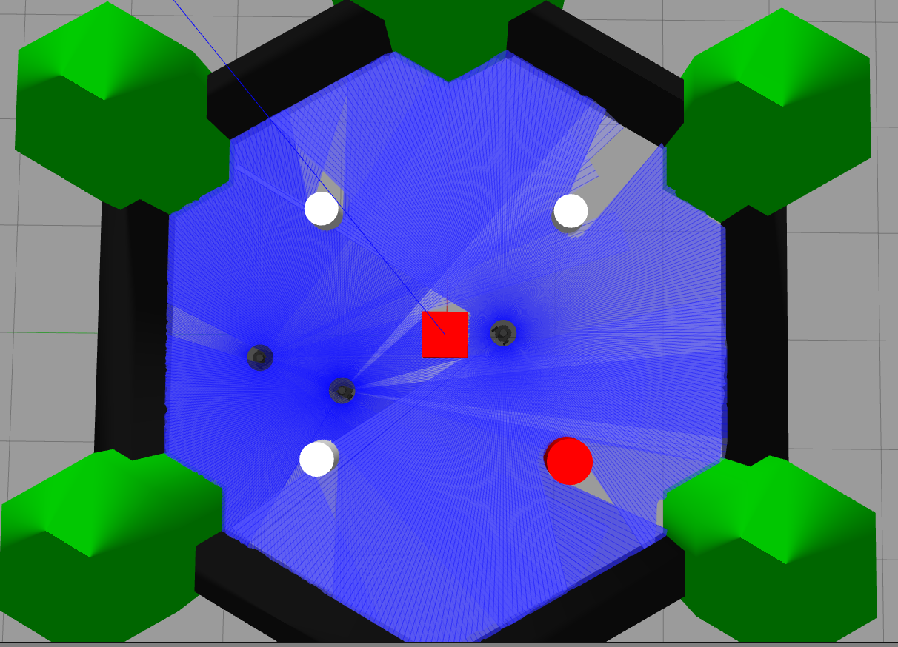

# Cooperative Multi-Robot Navigation in a Warehouse-like Environment

This project implements cooperative multi-robot navigation using **3 TurtleBot3 Burger robots** in **ROS 2 Humble** and **Gazebo**.

The project demonstrates:

- Displacement-based triangular formation control
- Robot-to-robot collision avoidance
- Known obstacle avoidance using repulsive safety control
- LiDAR-based unknown obstacle avoidance
- Connectivity maintenance between neighbouring robots
- Integrated waypoint-based cooperative mission execution

---

## Project Objective

The objective is to coordinate multiple mobile robots in a shared indoor environment while maintaining:

- formation structure
- safe inter-robot distance
- obstacle avoidance
- communication/connectivity links

The selected use-case is a **warehouse-like indoor navigation scenario**, where multiple robots move cooperatively while avoiding obstacles and maintaining group behaviour.

---

## Robot Platform

- 3 × TurtleBot3 Burger robots
- ROS 2 Humble
- Gazebo Classic simulation
- Differential-drive mobile robot model
- Odometry-based pose feedback
- TurtleBot3 LiDAR scan data

---

## Implemented Approaches

### 1. Displacement-Based Formation Control

A displacement-based control strategy is used to form a triangular structure between the three robots.

TB3_2 acts as the anchor/reference robot, while TB3_1 and TB3_3 move relative to TB3_2 using desired displacement offsets.

The controller computes relative displacement error between neighbouring robots and converts the resulting control vector into TurtleBot3 velocity commands.

This demonstrates:

- triangular formation initialization
- relative displacement-based coordination
- movement of the formed group toward a goal point

---

### 2. Collision Avoidance and LiDAR Obstacle Avoidance

A hybrid collision avoidance strategy is implemented for waypoint-based robot motion.

The system includes:

- known obstacle avoidance
- robot-to-robot collision avoidance
- LiDAR-based unknown obstacle avoidance

Known obstacles are handled using repulsive safety control. Nearby robots are treated as dynamic obstacles. Selected unmodelled/unknown obstacles are handled reactively using TurtleBot3 LiDAR scan data.

For LiDAR-based avoidance, front scan sectors are monitored. If an obstacle is detected too close in front of the robot, the robot slows down, stops, or turns away depending on the measured distance.

---

### 3. Connectivity Maintenance

Connectivity maintenance is implemented to preserve communication links between neighbouring robots in the defined communication topology.

The communication topology is:

- TB3_2 ↔ TB3_1
- TB3_2 ↔ TB3_3

There is no direct TB3_1 ↔ TB3_3 communication link.

During the demo, TB3_2 intentionally moves away to stretch the network. If the distance between neighbouring robots exceeds the soft threshold, corrective motion is generated. If the critical threshold is exceeded, stronger recovery action is applied.

This demonstrates:

- distance-based connectivity monitoring
- soft and critical connectivity thresholds
- recovery motion toward neighbouring robots

---

### 4. Integrated Cooperative Mission

The final integrated controller combines:

- displacement-based formation control
- waypoint navigation
- known obstacle avoidance
- robot-to-robot collision avoidance
- LiDAR-based unknown obstacle avoidance
- connectivity maintenance
- final formation reforming

Mission sequence:

1. Robots first form a triangular structure.
2. The anchor robot guides the group through waypoints.
3. Collision avoidance and LiDAR avoidance are applied during motion.
4. Connectivity maintenance prevents neighbouring robots from separating too far.
5. After the final waypoint, the robots reform the triangle and stop.

---

## Simulation Environments

Two simulation environments are used.

### Clean World

Used for:

- displacement-based formation control
- connectivity maintenance

This environment is used when the focus is on formation and communication-distance behaviour without obstacle clutter.

Relevant files:

```bash
multi_robot_clean.launch.py
turtlebot3_world_clean.world
model_clean.sdf
```

### Obstacle World

Used for:

- collision avoidance
- integrated cooperative mission

This environment includes known obstacles and selected unknown obstacles for LiDAR-based reactive avoidance.

Relevant files:

```bash
multi_robot.launch.py
turtlebot3_world.world
model.sdf
```

---

## Repository Structure

```bash
multi_robot_navigation/
│
├── images/
│   ├── formation.png
│   ├── collision.png
│   ├── integrated.png
│
├── multi_robot_follow/
│   ├── multi_robot_follow/
│   │   ├── displacement_formation.py
│   │   ├── collision_avoidance_only.py
│   │   ├── connectivity_maintenance_only.py
│   │   └── integrated_multi_robot.py
│   │
│   ├── package.xml
│   ├── setup.py
│   └── setup.cfg
│
├── turtlebot3_modified_files/
│   ├── multi_robot.launch.py
│   ├── multi_robot_clean.launch.py
│   ├── turtlebot3_world.world
│   ├── turtlebot3_world_clean.world
│   ├── model.sdf
│   └── model_clean.sdf
│
└── README.md
```

---

## Simulation Results

### Displacement-Based Formation


### Collision Avoidance


### Integrated Cooperative Mission


---

## Limitations

Current limitations:

- Simulation-only implementation
- Static indoor obstacle environment
- No real TurtleBot3 hardware validation
- Reactive obstacle avoidance instead of global path planning
- Fixed three-robot setup
- Fixed neighbour communication topology

---

## Future Work

Possible improvements:

- smoother trajectory planning
- dynamic obstacle handling
- more formal CBF-QP safety controller
- scalable communication graph for larger robot teams
- physical TurtleBot3 testing
- improved formation recovery in cluttered environments

---
